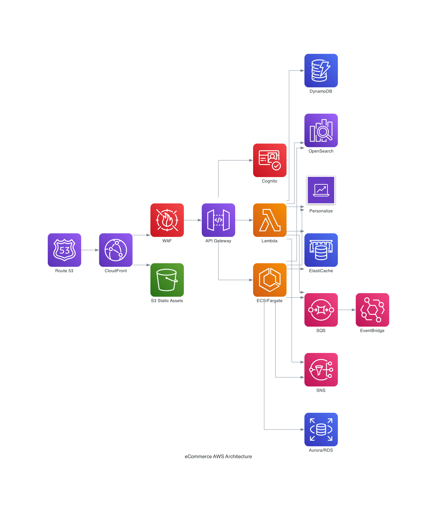

# eCommerce System

## Overview
This project is a modern, scalable eCommerce platform built on AWS using microservices architecture.

## Architecture


## Main Components
- [Frontend](frontend/): Web application (React/Next.js or other)
- [Backend](backend/): Microservices (FastAPI)
- [Services Breakdown](services/README.md): Microservices responsibilities
- [Infrastructure as Code](infra/terraform/): Terraform modules for AWS resources
- [Diagrams](diagrams/): Architecture diagram source

## Getting Started
1. Review the architecture diagram above.
2. See each component directory for setup instructions.
3. To generate the architecture diagram, run:
   ```bash
   pip install diagrams
   python diagrams/architecture.py
   ```

---

For more details on each microservice, see [services/README.md](services/README.md).
